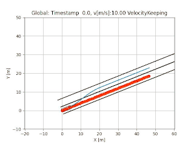
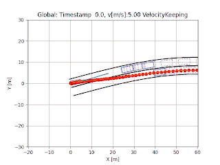
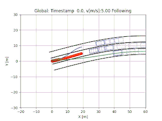
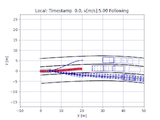

# Local Frenet Plannner


|  |  |  |
|:-------------------------:|:-------------------------:|:-------------------------:|
| Stop Scene   | Two-lane Moving Traffic  | Three-lane Moving Traffic   |


## Setup
Install Python dependencies: 
```
python3.8 -m pip install -r requirements.txt
```
Build the repo:

```
./build.sh
```

## Run

Running under vehicle local coordinate system without absolute localization: 

```
python3.8 scripts/fot_v2.py --local_planning
```

## Overview
This repository implements a local planning framework without the availability of global/absolute localization information. Rather, the local planning is done under the vehicle local coordinate system. This approach relies on motion sensors to estimate the pose change of the ego car and to associate with last planning result. The measurements from speed and yaw rate are modeled with an offset error and a Gaussian noise. 

The planning algorithm contains a fast, c++ implementation of the frenet optimal trajectory generation. The repo is partially based on the work,  [frenet_optimal_trajectory_planner](https://github.com/fangedward/frenet_optimal_trajectory_planner.git), but also add representations of car, obstacles, and road lanes to approximate the real world driving scenarios. Besides the velocity keeping mode, the planner also adds a following/stopping mode to allow it to follow the leading car in front. The candiate trajectories are extended to the same length of 5.0 seconds to ensure consisitent cost comparisons and safety check. Collision check is modified to enable the examination of box to box in any directions using the Separating Axis Theorem. And of course, another adds-on is the option to run the planner under the local coordinate system and consider the measurement errors of the motion sensors. 


## Example Usage

Use `fot_v2.py` to call the planning algorithm.

```
python3 scripts/fot_v2.py --local_planning
```

Here are some flags you can pass in:
* `--scene_path`, specify the path to the scene file. Default is `scenes/two_lanes.json`.
* `--local_planning`, run the planner under local coordinate system. Default is `False` running under global coordinate system.


### Add Scenes
Scenes are defined in `scenes/` folder. Three scenes (stop, two-lane, three-lane) are already defined as examples. You can add your own scenes by following the formats.


### Global vs Local View

The view from the vehice local coordinate system is also available with candidate trajecotories in dashed blue lines. Each trajectory has the same planning horizion of 5.0 seconds. 

|  |   |
|:-------------------------:|:-------------------------:|
| Global View   | Local View  | 


### Speed Up Performance

To enable threading, specify the number of threads you want to use for `num_threads` in `hyperparameters.json`. Setting this value to `0` disables the use of multi threading.

### Citation

If you find this repository helpful or use its contents in your work, please consider citing our [paper](https://arxiv.org/abs/2309.03051).


```
# BibTex

@article{zhu2023local,
   author = {Zhu, Sheng and Wang, Jiawei and Yang, Yu and Aksun-Guvenc, Bilin},
   title = {Feasibility of Local Trajectory Planning for Level-2+ Semi-autonomous Driving without Absolute Localization},
   journal = {arXiv preprint arXiv:2309.03051},
   year = {2023}
}

# IEEE format
S. Zhu, J. Wang, Y. Yang, and B. Aksun-Guvenc, "Feasibility of Local Trajectory Planning for Level-2+ Semi-autonomous Driving without Absolute Localization," arXiv preprint arXiv:2309.03051, 2023.


```
